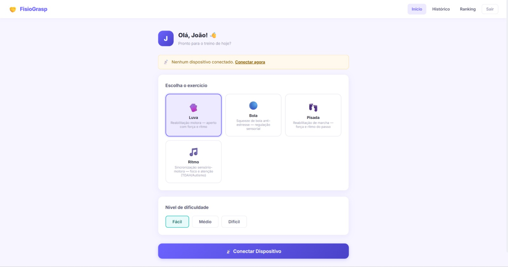
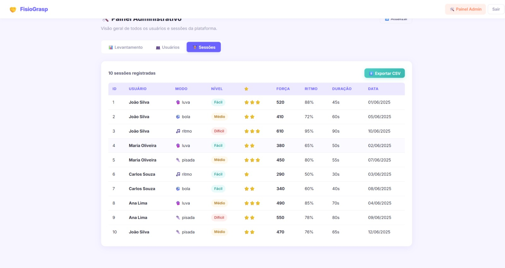

# FisioGrasp

Luva de reabilitação da mão com Arduino. Um sensor de força (FSR) mede o aperto, um ultrassônico
mede o movimento, e LEDs + buzzer avisam na hora se a força está dentro da faixa ideal. No fim da
sessão os dados vão por Bluetooth (HC-05) para o app, que guarda o histórico e monta um ranking.

Projeto P6 da PUC Minas, feito em grupo: Gustavo Ávila, Gustavo Henrique, Miguel Schiavon e
Henrique Rodrigues. Professor: Bernardo Guerra.

**Demo do sistema web:** https://mavilaa.github.io/Fisiogrip/
(entrar com `joao@email.com` / `123456`, ou `admin@fisiogrip.com` / `admin123` para o painel)

| Início | Painel admin |
|:---:|:---:|
|  |  |

Vídeo da luva funcionando: [`docs/demo-luva.mp4`](docs/demo-luva.mp4)

## O que tem aqui

```
app-android/   app do celular (MIT App Inventor) — importar o .aia em appinventor.mit.edu
frontend/      sistema web em React + Vite
backend/       API em C++ (cpp-httplib, JWT)
db/            MySQL: tabelas, views, procedures e triggers do ranking
docs/          apresentação, relatório do P6, prints e vídeo
```

Como as partes conversam:

```
Arduino --Bluetooth--> App / Front --HTTP + JWT--> Backend C++ --> MySQL (triggers atualizam o ranking)
```

## Estado atual

- Luva + app Android: é o que aparece no vídeo.
- O front ainda usa dados simulados (`frontend/src/mock`). As chamadas reais para o backend já estão
  escritas como comentário em `frontend/src/api/*.js`; falta trocar.
- O backend tem todas as rotas abaixo, mas ainda não foi ligado ao front.

## Rodar localmente

Banco (na ordem):

```sql
SOURCE db/tabelas.sql;
SOURCE db/views.sql;
SOURCE db/functions.sql;
SOURCE db/crud.sql;
SOURCE db/poo.sql;
SOURCE db/triggers.sql;
SOURCE db/logica.sql;
SOURCE db/dados.sql;
```

Backend (precisa de `libmysqlcppconn-dev`, `nlohmann-json3-dev` e `libssl-dev`):

```bash
cd backend
cp .env.example .env
set -a; source .env; set +a
make
./fisiogrip_server
```

Front:

```bash
cd frontend
npm install
npm run dev
```

## Rotas da API

| Método | Rota | O que faz |
|---|---|---|
| POST | /login, /register, /logout | autenticação |
| GET | /dispositivo/listar/:id | dispositivos do usuário |
| POST | /dispositivo/conectar | ativa a luva |
| POST | /sessao/iniciar, /sessao/encerrar | começa e fecha uma sessão |
| GET | /sessao/historico/:id | histórico |
| GET | /ranking/geral, /ranking/usuario/:id | ranking |
| GET | /admin/usuarios, /admin/sessoes, /admin/relatorio | painel do admin |

Os e-mails de admin ficam em `backend/security/admin_config.h`.

Licença MIT.
